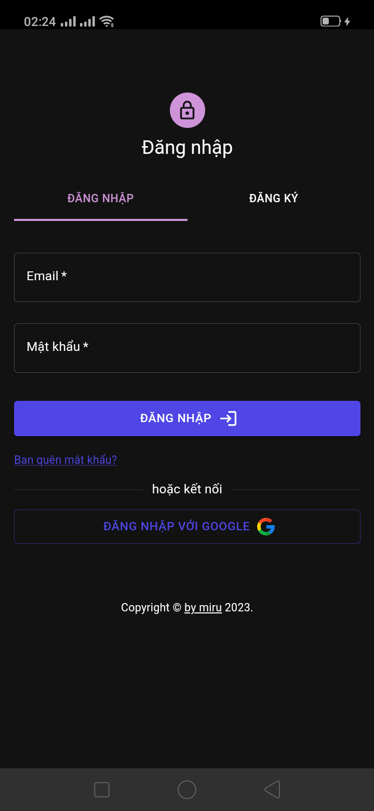
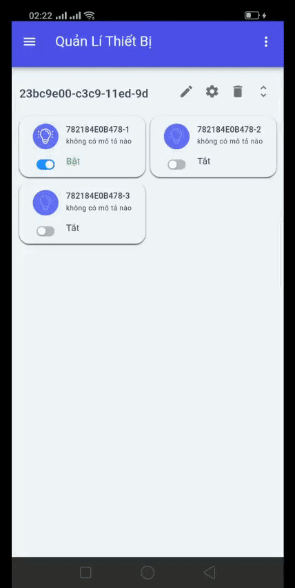

# Chào mừng bạn đến với dự án mã nguồn mở

Dự án này mình làm đồ án, bạn nào clone cũng được, có public nhớ ghi source dừm mình là được mình cảm ơn, nếu có gì thắc mắc tạo issues tab nha😊

# Giao diện đăng nhập
Hiện tại ứng dụng có khả năng đăng nhập, đăng ký tài khoản hoặc đăng nhập thông qua google,... Tương lai sẽ  có đăng nhập qua tài khoản github ^^

  

# Demo giao diện
Này là bản xem thử, một số tính năng cơ bản

  

